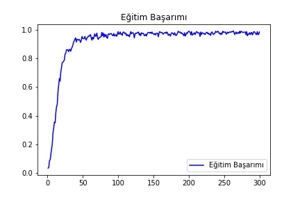
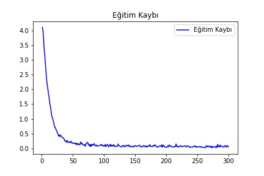

# Acıkhack2-keepmoving-covid19-chatbot

<table border="0" cellspacing="0" cellpadding="0" margin-left="auto" margin-right="auto" >
  <tr>
    <td valign="center">  </td>
    <td valign="top">
     Bu proje Teknofest 2020 Türkçe Doğal Dil İşleme Yarışması kapsamında <b>Keep Moving</b> ekibi tarafından geliştirilmiştir.
      
     This project developed for Teknofest 2020 (Türkçe Doğal Dil İşleme Yarışması) by <b>Keep Moving</b> team.
    </td>
  </tr>
</table>
   

# Özet

 Günümüz başlıca problemlerinden olan Covid-19 virüsü hakkında semptomlardan yola çıkarak bir sohbet uygulaması geliştirilmiştir. Kullanıcının uygulama kapsamında projeyi çalıştırıp, semptomlarını sohbet eder bir biçimde ifade etmesi sonucun tanımlanıp geri dönüt olarak verilmesi için yeterlidir. Kullanıcı Covid-19 hakkında merak ettiği soruları sohbet uygulamasına sorarak gerekli cevapları alabilir. Türkiye'ye ait günlük vaka, iyileşen hasta, vefat sayılarını sorarak öğrenebilir. Sohbet botunun sorulan sorulardan çıkarımlar yapabilmesi için yapay sinir ağında ve doğal dil işleme kütüphanesi olan NLTK'dan faydanılmıştır. Türkçe olarak geliştirilmiş bir sohbet botudur.

   

# Çalıştırma Rehberi

 Öncelikle "Proje İçin Gerekli Olan Kütüphaneler" alanında verilen kütüphanelerin kurulum işlemlerinin tamamlanması gerekmektedir. Bunun için 2 farklı yol izleyebilirsiniz. İsterseniz hazırlamış olduğumuz gereksinimler dosyası üzerinden "pip install gereksinimler.txt komutu ile gereken tüm kütüphaneleri kurabilirsiniz. Manuel olarak kurulum yapmak isterseniz "Proje İçin Gerekli Olan Kütüphaneler" alanında belirtilen kütüphaneleri ve sürümleri ilgili komutlarla çalıştırarak kurabilirsiniz.

 Projeyi gui.py dosyası üzerinden çalıştırmalısınız. İlgili dosyalar birbirine bağlı olup son kullanıcıya uygun olacak şekilde gui.py dosyası üzerinde sunulmaktadır. 

   
> **Not:** Projeye ait .exe dosyası sunum için derlenip, sizlerle paylaşılacaktır.
   

# Proje Ön Gösterim
<table width="500" border="0" cellspacing="0" cellpadding="0" margin-left="auto" margin-right="auto">
  <tr>
    <td valign="center">
     <b>Covid-19 Olasılığının Hesaplanması</b>
    </td>
    <td valign="center">  </td>
  </tr>
  <tr>
    <td valign="center">
     <b>Covid-19 Genel Bilgi Sorgulama</b>
    </td>
    <td valign="center">  </td>
  </tr>
  <tr>
    <td valign="center">
     <b>Türkiye Güncel Vaka Sayısı Öğrenme</b>
    </td>
    <td valign="center">  </td>
  </tr>
</table>
   

# Youtube Sunumu
<table border="0" cellspacing="0" cellpadding="0" margin-left="auto" margin-right="auto" >
  <tr>
    <td valign="center">Youtube Sunum Linki </td>
    <td valign="center"><a href="https://www.youtube.com/" target="_blank"> Sunum için tıklayınız </a></td>
  </tr>
</table>
   

# Kullanılan Yapay Sinir Ağı Modeli

   

# Yapay Sinir Ağı Eğitimine Ait Başarım ve Kayıp Grafikleri

   

# Proje Ekibi
<table border="0" cellspacing="0" cellpadding="0" margin-left="auto" margin-right="auto" >
  <tr>
    <td valign="center"> <b> Ekip Kaptanı </b> </td>
    <td valign="center"> Burak Doğukan DAĞLI</td>
    <td valign="center"> bdogukandagli@gmail.com </td>
  </tr>
  <tr>
    <td valign="center"> <b> Ekip Üyesi </b> </td>
    <td valign="center"> Mehmet Kaan KARABULUT</td>
    <td valign="center"> kaankarabulutt1@gmail.com </td>
  </tr>
  <tr>
    <td valign="center"> <b> Ekip Üyesi </b> </td>
    <td valign="center"> Murat Can TANRIVERDİ </td>
    <td valign="center"> muratcantanriverdi96@gmail.com </td>
  </tr>
  <tr>
    <td valign="center"> <b> Ekip Üyesi </b> </td>
    <td valign="center"> Halil AKBULUT</td>
    <td valign="center"> halilakbuluteru@gmail.com </td>
  </tr>
</table>
   

# Proje İçin Gerekli Olan Kütüphaneler
|    Type            |Name                          |Install                         |
|----------------|-------------------------------|-----------------------------|
|Language|    Python 3.6.7       |`www.python.org`      |
|Library|    NLTK v.35       |`pip install nltk==3.5`      |
|Library|    snowballstemmer v2.0.0       |`pip install snowballstemmer==2.0.0` |
|Library|    tensorflow v1.14.0       |`pip install tensorflow=1.14.0`      |
|Library|    keras v2.3.1       |`pip install keras==2.3.1`      |
|Library|    matplotlib 3.3.0   |`pip install matplotlib`      |
|Library|    pandas 1.1.0.      |`pip install pandas`      |
|Library|    json        |`pip install json`      |
|Library|    numpy       |`pip install numpy`      |
|Library|    requests    |`pip install requests`   |
|Library|    bs4 0.0.1   |`pip install bs4`        |
|Library|    lxml 4.5.2  |`pip install lxml`      |

   
> **Not:** Kütüphaneler ve çalıştırma konusunda hata almanız durumunda ekip ile iletişime geçebilirsiniz.
